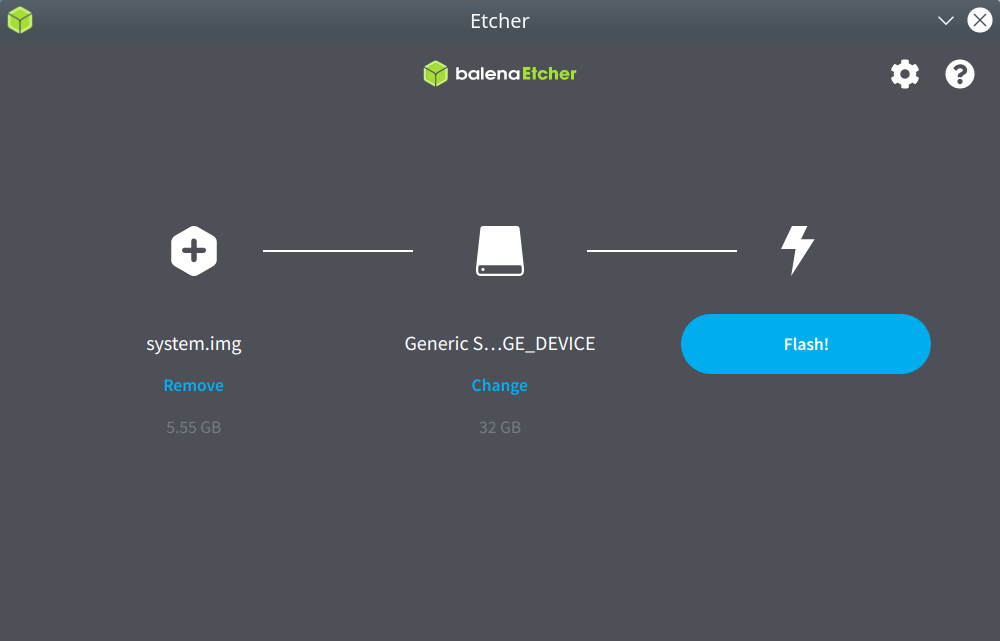

# **Guide for Flashing to SDCard**

## **1. Requirements**
1. BrainyPi v1.0
1. Compiled Linux image `system.img`
1. Linux Laptop/PC

## 2. Download Etcher

1.  Download and Install [Balena Etcher](https://www.balena.io/etcher/) for flashing Linux into microSD card.

## 3. Flash into microSD card

1.  Plug the microSD card into a laptop/computer using a microSD Card adapter/reader.
1.  Click on "Flash from file" and select the Linux  `system.img` file.
1.  Click on "Select target" and choose your microSD card.
1.  Click on "Flash!", this will load the microSD card with Linux.

    
